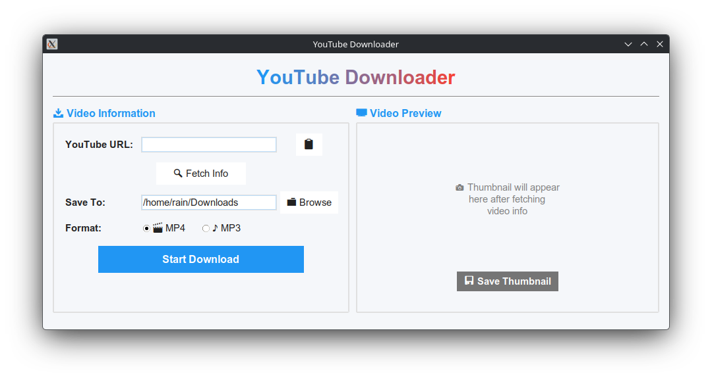

<div align="center">

# 🎥 YouTube Downloader

**A modern, robust, and beautiful YouTube video downloader built with Python & Tkinter.**

[](https://www.python.org/)
[](https://docs.python.org/3/library/tkinter.html)
[](https://github.com/yt-dlp/yt-dlp)
[](LICENSE)

<br />



<br />

</div>

## ✨ Features

- **📺 Video & Audio**: Download videos in high-quality **MP4** or extract audio as **MP3**.
- **🖼️ Smart Preview**: Automatically fetches and displays video thumbnails before downloading.
- **🚀 Real-time Progress**: Track download speed, size, and ETA with a clean progress indicator.
- **🎨 Modern UI**: A polished, user-friendly interface with gradient titles and intuitive controls.
- **⚡ Threaded Core**: Keeps the interface responsive even during heavy downloads.
- **📋 Clipboard Support**: Paste URLs directly from your clipboard with a single click.

## 🛠️ Installation

### Prerequisites

- Python 3.8 or higher
- [FFmpeg](https://ffmpeg.org/) (Required for MP3 conversion and some video formats)

### Quick Start

1. **Clone the repository**
   ```bash
   git clone https://github.com/Kanvad/tkinter-youtube-downloader.git
   cd tkinter-youtube-downloader
   ```

2. **Create a virtual environment (Recommended)**
   ```bash
   python -m venv .venv
   # On Linux/MacOS:
   source .venv/bin/activate  
   # On Windows:
   .venv\Scripts\activate
   ```

3. **Install dependencies**
   ```bash
   pip install -r requirements.txt
   ```

   *If `requirements.txt` is missing:*
   ```bash
   pip install yt-dlp Pillow
   ```

## 🚀 Usage

1. Run the application:
   ```bash
   python youtube_downloader.py
   ```

2. **Paste** a YouTube link into the URL field.
3. Click **🔍 Fetch Info** to preview the video.
4. Select your desired format (**MP4** or **MP3**).
5. Choose a save location (Default is your Downloads folder).
6. Click **Start Download** and enjoy!

## 🏗️ Tech Stack

- **Language**: Python 3
- **GUI Framework**: Tkinter (ttk)
- **Core Engine**: [yt-dlp](https://github.com/yt-dlp/yt-dlp)
- **Image Processing**: Pillow (PIL)

## 📄 License

This project is licensed under the MIT License - see the [LICENSE](LICENSE) file for details.
